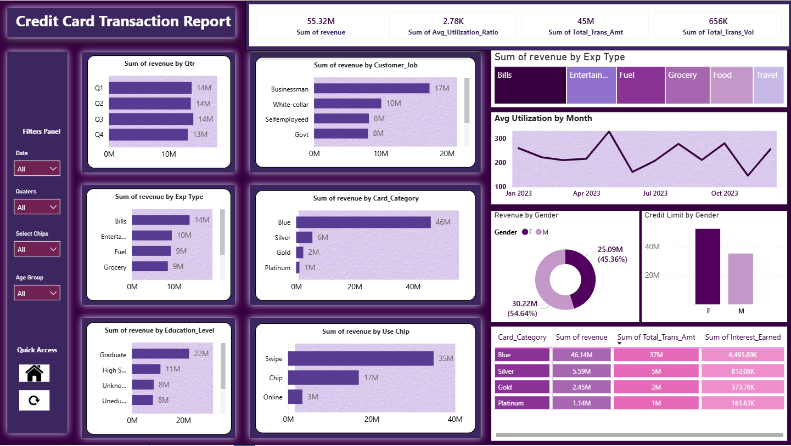
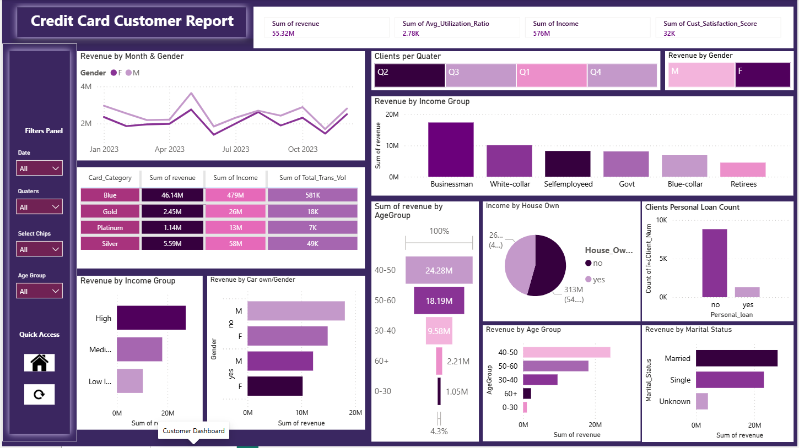

<h2>Credit Card Transaction Report</h2>

  

<h2>Credit Card Customer Report</h2>

  

# Credit Card Analytics Dashboard | Power BI

## Project Overview

**Project Title:** Credit Card Analytics Dashboard

This project focuses on analysing credit card transactions and customer behaviour using Power BI. The dashboard provides insights into revenue performance, spending patterns, customer demographics, transaction behaviour, and credit card usage trends. The goal is to transform raw financial data into actionable business insights through interactive visualisations and KPI tracking.

---

## Objectives

1. Clean and transform credit card transaction and customer data.
2. Analyse customer spending behaviour and transaction trends.
3. Identify key revenue drivers across customer segments.
4. Build interactive dashboards for business decision-making.
5. Generate insights related to customer demographics, card usage, and revenue performance.

---

## Project Structure

### 1. Data Preparation

* Cleaned and transformed raw datasets using Power Query.
* Handled missing values and inconsistent data formats.
* Created calculated columns and measures based on business requirements.

### 2. Data Modeling

* Established relationships between customer and transaction datasets.
* Created a structured data model for efficient analysis and reporting.

### 3. Dashboard Development

Built two interactive dashboards:

#### Credit Card Transaction Report

Provides analysis of:

* Revenue by Quarter
* Revenue by Expense Type
* Revenue by Card Category
* Revenue by Customer Job
* Revenue by Education Level
* Revenue by Card Usage Method
* Monthly Utilisation Trends
* Gender-Based Revenue Analysis
* Credit Limit Comparison

#### Credit Card Customer Report

Provides analysis of:

* Revenue by Income Group
* Revenue by Age Group
* Revenue by Gender
* Revenue by Marital Status
* Revenue by House Ownership
* Personal Loan Distribution
* Customer Segmentation Analysis
* Quarterly Customer Trends

---

## Key Performance Indicators (KPIs)

* Total Revenue
* Total Transaction Amount
* Total Transaction Volume
* Average Utilisation Ratio
* Total Customer Income
* Customer Satisfaction Score
* Interest Earned

---

## Key Insights

* The Blue Card category generated the highest revenue contribution.
* Bills and Entertainment were among the leading spending categories.
* Swipe transactions accounted for the majority of card usage.
* Customers aged 40–50 contributed the highest revenue share.
* Female customers showed higher credit limits in comparison to male customers.
* Businessman and White-Collar customer segments generated the highest revenue.

---

## Tools & Technologies Used

* Power BI
* Power Query
* DAX
* Data Modeling
* Data Cleaning
* Data Visualisation
* Business Intelligence

---

## Skills Demonstrated

* Data Transformation
* Data Modeling
* Dashboard Design
* KPI Development
* DAX Measures
* Business Analysis
* Financial Data Analysis
* Interactive Reporting

---

## Dashboard Features

* Interactive slicers and filters
* Dynamic KPI cards
* Drill-down analysis
* Customer segmentation
* Revenue trend analysis
* Transaction behaviour analysis

---

## Conclusion

This project demonstrates how to use Power BI to transform raw financial data into meaningful business insights. Through data cleaning, modeling, DAX calculations, and dashboard development, the project provides a comprehensive view of customer behavior, transaction performance, and revenue trends that can support data-driven decision-making.
